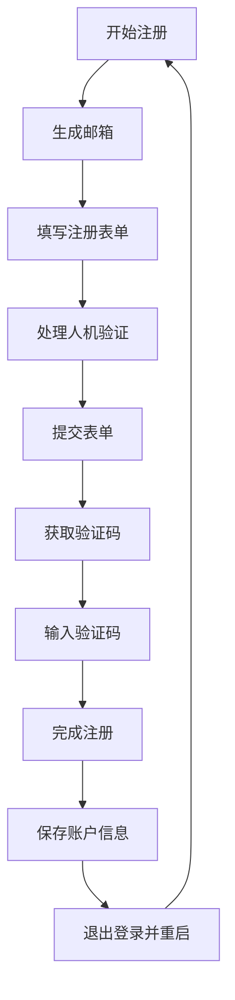

# AugmentCode 自动注册工具

🤖 一个功能强大的 Tampermonkey 用户脚本，用于 AugmentCode 账户的自动化批量注册。

[](https://github.com/AMag1c/AugmentCode-AutoRegister-Userscript)
[](LICENSE)
[](https://www.tampermonkey.net/)
[](https://github.com/AMag1c/AugmentCode-AutoRegister-Userscript/stargazers)

中文文档 | [English](README_EN.md)

> ⭐ **如果这个项目对您有帮助，请给个 Star 支持一下！** ⭐

## ✨ 功能特性

- 🚀 **全自动注册** - 完全自动化的账户创建流程
- 📧 **邮箱生成** - 自动生成随机真实姓名的邮箱地址
- 🔐 **人机验证** - 智能处理验证码和人机验证
- 📨 **邮件验证** - 自动获取和输入邮件验证码
- 🔄 **持续模式** - 批量注册，支持连续处理
- 💾 **账户管理** - 保存和导出已注册的账户信息
- 🛡️ **错误处理** - 强大的错误处理和重试机制
- 📊 **实时界面** - 实时状态更新和注册进度显示
- 🔄 **拒绝恢复** - 注册被拒绝时自动重试

## 🌟 为什么选择这个工具？

- ✅ **完全免费开源** - MIT 许可证，永久免费使用
- ✅ **无需服务器** - 纯前端脚本，本地运行
- ✅ **隐私安全** - 所有数据本地存储，不上传任何信息
- ✅ **持续更新** - 活跃维护，及时适配网站变化
- ✅ **简单易用** - 一键安装，自动运行

## 🚀 快速开始

### 前置要求

- [Tampermonkey](https://www.tampermonkey.net/) 浏览器扩展
- Chrome、Firefox、Edge 或 Safari 浏览器

### 📦 安装方法

#### 方法一：直接安装（推荐）
1. **安装 Tampermonkey** 浏览器扩展
2. **点击安装脚本** [直接安装链接](https://github.com/AMag1c/AugmentCode-AutoRegister-Userscript/raw/main/AugmentCode-AutoRegister-Userscript.js)
3. **确认安装** 在弹出的 Tampermonkey 安装页面
4. **访问注册页面** 开始使用

#### 方法二：手动安装
1. **下载脚本** 从 `AugmentCode-AutoRegister-Userscript.js` 文件
2. **打开 Tampermonkey** 管理面板
3. **创建新脚本** 并粘贴代码
4. **保存脚本** 并启用

### 🎮 使用方法

1. **访问** 任意 AugmentCode 页面 (`*.augmentcode.com`)
2. **控制面板** 会自动出现在页面右上角
3. **点击"开始持续注册"** 开始自动化流程
4. **监控进度** 通过实时日志查看注册状态
5. **导出账户** 注册完成后下载账户信息

### 📱 界面预览

```
┌─────────────────────────────────┐
│ 🤖 AugmentCode 自动注册         │
├─────────────────────────────────┤
│ 注册状态: 持续注册中            │
│ 已注册: 5个账户                 │
├─────────────────────────────────┤
│ [停止注册] [导出账户] [清除账户] │
└─────────────────────────────────┘
```

## 🎮 控制面板

脚本提供直观的控制面板，包含：

- **开始/停止注册** - 控制自动化流程
- **账户计数器** - 实时注册统计
- **导出账户** - 下载已注册的账户信息
- **清除账户** - 重置账户数据
- **实时日志** - 实时流程监控

## 🔧 配置说明

### 邮箱设置

```javascript
const EMAIL_DOMAIN = "@test.com";
const TEMP_MAIL_CONFIG = {
    username: "test",    // 临时邮箱用户名
    emailExtension: "@mailto.plus", // 临时邮箱域名
    epin: "000"     // 临时邮箱PIN码
};
```

### 姓名生成

脚本使用预定义的姓名列表生成真实的邮箱地址：

```javascript
const FIRST_NAMES = ["alex", "emily", "jason", "olivia", ...];
const LAST_NAMES = ["taylor", "anderson", "thompson", ...];
```

## 📋 流程图



## 🛠️ 技术细节

### 页面检测

脚本智能检测不同的页面状态：

- **注册页面** - 邮箱输入和表单提交
- **验证页面** - 邮件验证码输入和验证
- **成功页面** - 账户信息提取
- **拒绝页面** - 自动重试处理

### 错误处理

- **网络超时** 自动重试
- **验证码失败** 智能重试逻辑
- **邮件延迟** 延长等待时间
- **注册被拒** 自动重试链接

## 📊 功能概览

| 功能 | 描述 | 状态 |
|------|------|------|
| 自动邮箱生成 | 随机真实邮箱地址 | ✅ |
| 人机验证 | 验证码和人机验证处理 | ✅ |
| 邮件验证码获取 | 自动验证码提取 | ✅ |
| 批量处理 | 持续注册模式 | ✅ |
| 账户导出 | CSV/TXT 导出功能 | ✅ |
| 错误恢复 | 自动重试和错误处理 | ✅ |
| 实时界面 | 实时进度监控 | ✅ |
| 拒绝处理 | 自动重试被拒注册 | ✅ |

## 🔒 隐私与安全

- **无数据收集** - 所有处理都在本地进行
- **临时邮箱** - 使用一次性邮箱服务
- **本地存储** - 账户数据仅存储在浏览器中
- **无外部服务器** - 直接与目标网站通信

## 🤝 贡献

欢迎贡献！请随时提交 Pull Request。

1. Fork 这个仓库
2. 创建你的功能分支 (`git checkout -b feature/AmazingFeature`)
3. 提交你的更改 (`git commit -m 'Add some AmazingFeature'`)
4. 推送到分支 (`git push origin feature/AmazingFeature`)
5. 打开一个 Pull Request

## 📄 许可证

本项目采用 MIT 许可证 - 查看 [LICENSE](LICENSE) 文件了解详情。

## ⚠️ 免责声明

此工具仅用于教育和测试目的。请确保您遵守使用此脚本的任何网站的服务条款。作者不对此工具的任何误用负责。

## 🙏 致谢

- [Tampermonkey](https://www.tampermonkey.net/) 提供用户脚本平台
- [TempMail.plus](https://tempmail.plus/) 提供临时邮箱服务
- 开源社区的灵感和支持

---

**⭐ 如果这个项目对您有帮助，请给个 Star 支持一下！⭐**

## 📞 联系方式

如果您有任何问题或建议，欢迎：

- 📝 [提交 Issue](https://github.com/AMag1c/AugmentCode-AutoRegister-Userscript/issues)
- 🔧 [提交 Pull Request](https://github.com/AMag1c/AugmentCode-AutoRegister-Userscript/pulls)
- ⭐ [给项目点个 Star](https://github.com/AMag1c/AugmentCode-AutoRegister-Userscript/stargazers)

## 📈 项目统计


