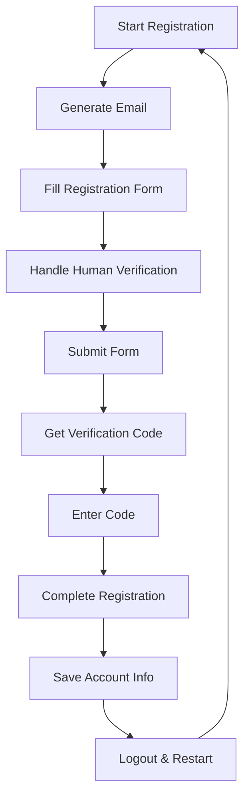

# AugmentCode AutoRegister

🤖 A powerful Tampermonkey userscript for automated AugmentCode account registration with batch processing capabilities.

[](https://github.com/AMag1c/AugmentCode-AutoRegister-Userscript)
[](LICENSE)
[](https://www.tampermonkey.net/)
[](https://github.com/AMag1c/AugmentCode-AutoRegister-Userscript/stargazers)

[中文文档](README.md) | English

> ⭐ **If this project helps you, please give it a Star!** ⭐

## ✨ Features

- 🚀 **Automated Registration** - Fully automated account creation process
- 📧 **Email Generation** - Automatic email address generation with random names
- 🔐 **Human Verification** - Intelligent CAPTCHA and human verification handling
- 📨 **Email Verification** - Automatic email code retrieval and input
- 🔄 **Continuous Mode** - Batch registration with continuous processing
- 💾 **Account Management** - Save and export registered account information
- 🛡️ **Error Handling** - Robust error handling and retry mechanisms
- 📊 **Real-time UI** - Live status updates and registration progress
- 🔄 **Rejection Recovery** - Automatic retry when registration is rejected

## 🌟 Why Choose This Tool?

- ✅ **Completely Free & Open Source** - MIT License, forever free
- ✅ **No Server Required** - Pure frontend script, runs locally
- ✅ **Privacy & Security** - All data stored locally, no uploads
- ✅ **Continuous Updates** - Actively maintained, timely website adaptation
- ✅ **Easy to Use** - One-click installation, automatic operation

## 🚀 Quick Start

### Prerequisites

- [Tampermonkey](https://www.tampermonkey.net/) browser extension
- Chrome, Firefox, Edge, or Safari browser

### 📦 Installation

#### Method 1: Direct Install (Recommended)
1. **Install Tampermonkey** browser extension
2. **Click install script** [Direct install link](https://github.com/AMag1c/AugmentCode-AutoRegister-Userscript/raw/main/AugmentCode-AutoRegister-Userscript.js)
3. **Confirm installation** in Tampermonkey popup
4. **Visit registration page** to start using

#### Method 2: Manual Install
1. **Download script** from `AugmentCode-AutoRegister-Userscript.js`
2. **Open Tampermonkey** dashboard
3. **Create new script** and paste code
4. **Save script** and enable

### 🎮 Usage

1. **Visit** any AugmentCode page (`*.augmentcode.com`)
2. **Control Panel** will appear automatically in top-right corner
3. **Click "Start Continuous Registration"** to begin automation
4. **Monitor progress** through real-time logs
5. **Export accounts** when registration is complete

### 📱 Interface Preview

```
┌─────────────────────────────────┐
│ 🤖 AugmentCode AutoRegister     │
├─────────────────────────────────┤
│ Status: Continuous Registration │
│ Registered: 5 accounts          │
├─────────────────────────────────┤
│ [Stop] [Export] [Clear Accounts]│
└─────────────────────────────────┘
```

## 🎮 Control Panel

The script provides an intuitive control panel with:

- **Start/Stop Registration** - Control the automation process
- **Account Counter** - Real-time registration statistics  
- **Export Accounts** - Download registered account information
- **Clear Accounts** - Reset account data
- **Live Logs** - Real-time process monitoring

## 🔧 Configuration

### Email Settings

```javascript
const EMAIL_DOMAIN = "@test.com";
const TEMP_MAIL_CONFIG = {
    username: "test",    // Temporary email username
    emailExtension: "@mailto.plus", // Temporary email domain
    epin: "000"     // Temporary email PIN
};
```

### Name Generation

The script uses predefined lists of first and last names for realistic email generation:

```javascript
const FIRST_NAMES = ["alex", "emily", "jason", "olivia", ...];
const LAST_NAMES = ["taylor", "anderson", "thompson", ...];
```

## 📋 Process Flow



## 🛠️ Technical Details

### Page Detection

The script intelligently detects different page states:

- **Registration Page** - Email input and form submission
- **Verification Page** - Email code input and validation
- **Success Page** - Account information extraction
- **Rejection Page** - Automatic retry handling

### Error Handling

- **Network timeouts** with automatic retry
- **CAPTCHA failures** with intelligent retry logic
- **Email delivery delays** with extended waiting periods
- **Registration rejections** with automatic retry links

## 📊 Features Overview

| Feature | Description | Status |
|---------|-------------|--------|
| Auto Email Generation | Random realistic email addresses | ✅ |
| Human Verification | CAPTCHA and verification handling | ✅ |
| Email Code Retrieval | Automatic verification code extraction | ✅ |
| Batch Processing | Continuous registration mode | ✅ |
| Account Export | CSV/TXT export functionality | ✅ |
| Error Recovery | Automatic retry and error handling | ✅ |
| Real-time UI | Live progress monitoring | ✅ |
| Rejection Handling | Auto-retry rejected registrations | ✅ |

## 🔒 Privacy & Security

- **No data collection** - All processing happens locally
- **Temporary emails** - Uses disposable email services
- **Local storage** - Account data stored in browser only
- **No external servers** - Direct communication with target site

## 🤝 Contributing

Contributions are welcome! Please feel free to submit a Pull Request.

1. Fork the repository
2. Create your feature branch (`git checkout -b feature/AmazingFeature`)
3. Commit your changes (`git commit -m 'Add some AmazingFeature'`)
4. Push to the branch (`git push origin feature/AmazingFeature`)
5. Open a Pull Request

## 📄 License

This project is licensed under the MIT License - see the [LICENSE](LICENSE) file for details.

## ⚠️ Disclaimer

This tool is for educational and testing purposes only. Please ensure you comply with the terms of service of any website you use this script with. The authors are not responsible for any misuse of this tool.

## 🙏 Acknowledgments

- [Tampermonkey](https://www.tampermonkey.net/) for the userscript platform
- [TempMail.plus](https://tempmail.plus/) for temporary email services
- The open-source community for inspiration and support

---

**⭐ Star this repository if you find it helpful! ⭐**
